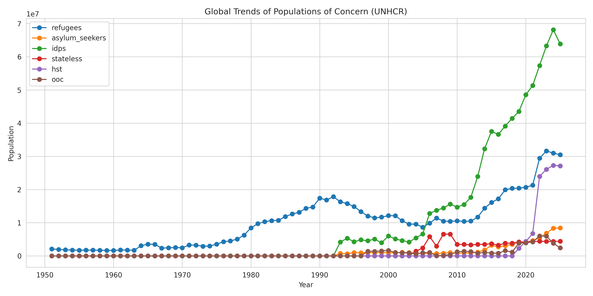
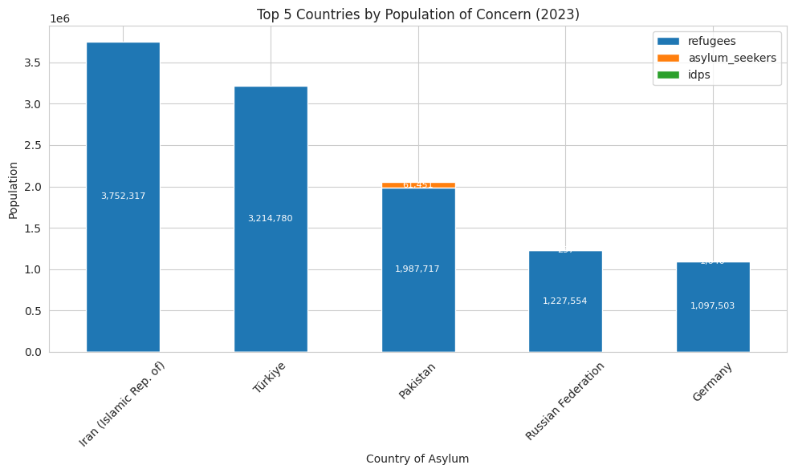

## UNHCR Population Trend Analysis & Business Insights

## Project Overview
This project demonstrates an end-to-end data analysis and business intelligence workflow using real-world refugee population data from UNHCR. The dataset contains country-level population counts of refugees, asylum seekers, internally displaced persons (IDPs), stateless persons, and host communities across multiple years.

The project’s focus is trend analysis, growth measurement, and anomaly detection, providing actionable insights that could inform strategic decision-making similar to how a business analyst examines customer or market data.

## Objective

- Analyze trends over time in global refugee populations.
- Identify top countries by population of concern each year.
- Calculate Year-over-Year growth and detect anomalies.
- Generate visualizations and insights to support data-driven decisions.

## Why This Dataset

- Large, real-world dataset with multiple years and countries.
- Mimics market/customer segmentation:
  - Country of Asylum → Market segment
  - Country of Origin → Customer type
  - Population counts → KPIs
- Provides complex, messy data suitable for demonstrating advanced analysis skills.

## Key Features

- Cleaned and processed raw data from `.rda` to CSV.
- Aggregated KPIs per year and by country.
- Year-over-Year growth and anomaly detection.
- Portfolio-ready visualizations: line plots, stacked bar charts.
- Exported summaries for dashboards (`global_totals.csv`).

## Tech Stack

- Python (Pandas, Matplotlib, Seaborn)
- Google Colab
- CSV Data from UNHCR

## Visualizations

### Global Trends of Populations of Concern

### Top 5 Countries by Population of Concern (2023)

## Insights

- Global refugee populations are increasing over time, with notable spikes in specific years.
- Certain countries consistently host the largest populations, highlighting potential areas for humanitarian support.
- Anomalies in growth trends provide insights into sudden crises or population shifts.
